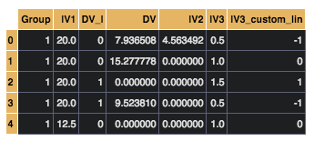

Categorical Predictors
=======================

Standard Regression Models
--------------------------
:code:`Lm()` models uses `patsy  <https://patsy.readthedocs.io/en/latest/>`_ to parse model formulae for *standard regression analyses*. Patsy is very powerful and has built-in support for handling categorical coding schemes (e.g. wrapping predictors in the :code:`C()` syntax). Patsy can also perform some pre-processing such as scaling and standardization.

Please refer to the `patsy documentation <https://patsy.readthedocs.io/en/latest/categorical-coding.html>`_ when working with standard regression models that have categorical predictors.

Multi-level Models
------------------
:code:`Lmer()` models currently have support for handling categorical predictors in one of two ways based on how R's :code:`factor()` works:

1. Dummy-coded factor levels in which each model term is the difference between a factor levels and a selected reference level
2. Orthogonal polynomial contrasts in which each model term is a polynomial contrast across factor levels (e.g. linear, quadratic, cubic, etc)

To make re-parameterizing models easier, factor codings are set as an argument to a model's :code:`fit` method. This obviates the need for adjusting data-frame properties as in R.

Dummy coding factors
--------------------
To dummy code factors simply pass a model's :code:`fit` method a dictionary with keys containing model terms to be treated as factors, and values as a list of unique factor levels.

The *first* term in the list will be treated as the reference level.

.. code-block:: python

    # Initialize a model using a categorical predictor
    model = Lmer('DV_l ~ IV3 + (IV3|Group)',data=df,family='binomial')

    # Dummy code factors and set 1.0 as the reference level for IV3
    model.fit(factors={
        'IV3':['1.0','0.5','1.5'],
        })

Polynomial contrast coding
--------------------------
Representing factors as polynomial contrasts is very similar. Like before, simply pass a model's :code:`fit` method a dictionary with keys containing model terms to be treated as factors, and values as a list of unique factor levels, as well as the :code:`ordered = True` flag.

This will treat the order of list items as the order of factor levels for the *linear* polynomial term. Each higher order polynomial (if required) will be automatically calculated orthogonally with respect to the linear contrast.

.. code-block:: python

    # Initialize a model using a categorical predictor
    model = Lmer('DV_l ~ IV3 + (IV3|Group)',data=df,family='binomial')

    # Using polynomial coding for IV3, since there are 3 factor levels this will result in two polynomial terms: a linear and quadratic contrast
    # Setup the linear contrast to test: 0.5 < 1.0 < 1.5
    # This will produce a quadratic term automatically testing: 0.5 > 1 < 1.5
    model.fit(factors={
        'IV3':['1.5','1.0','0.5'],
        ordered = True
        })

Custom parameterizations
------------------------
Unlike the methods above, testing specific parameterizations without relying on factor coding is often easier done by creating new columns in a dataframe with specific coding schemes. These new columns can be utilized within models to test specific hypotheses. *Note: this is also useful method if you don't want to use patsy's formula langauge with standard regression models as suggested above*.

This is trivial using pandas map and assign methods. Here we'll only build a linear contrast across factor levels (0.5 < 1.0 < 1.5), without all exhaustive higher level polynomial terms:

.. code-block:: python

    df = df.assign(
    IV_3_custom_lin = df['IV3'].map({
                                    0.5: -1,
                                    1.0: 0,
                                    1.5: 1
                                    })
    df.head()

Now we can estimate this model without the need to use the :code:`factor` argument to the model's :code:`fit` method.

.. code-block:: python

    model = Lmer('DV ~ IV3_custom_lin + (IV3_custom_lin|Group)', data=df)
    model.fit()
