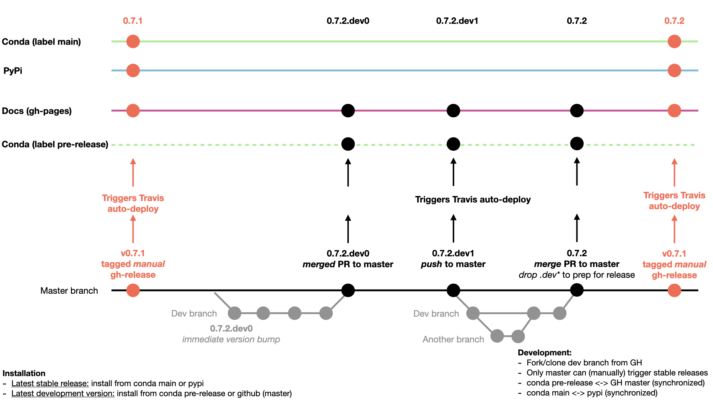

Contributing
============
Maintaining this package is tricky because of its inter-language operability. In particular this requires keeping up with API changes to Python packages (e.g. pandas), R packages (e.g. lmerTest) as well as changes in rpy2 (which tend to break between versions), the interface package between them. For these reasons contributions are **always** welcome! Checkout the `development roadmap on Trello <https://trello.com/b/gGKmeAJ4>`_. Also note the diagram and explanation below which illustrate how code development cycles work and how automated deployment is handled through Travis CI. 

Development Cycle and workflow
------------------------------

All work proceeds on the :code:`dev` branch. This can include direct commits and PRs from other (non-:code:`master`) branches. 

Each new *pre-release* should proceed by opening a pull-request (PR) the against :code:`master` branch. Merging this PR will automatically trigger a :code:`M.N.P.devX` release to :code:`ejolly/label/pre-release` on `anaconda cloud <https://anaconda.org/ejolly/repo/files?type=any&label=pre-release>`_ via Travis. Direct pushes to :code:`master` should be rare and primarily constitute documentation or devops changes rather than changes to the code base. These direct pushes will also trigger a pre-release.

Each new *stable* release should follow the following steps, the first of which can occur in two ways:  

- Step 1: drop :code:`.devX` from version string (in :code:`pymer4/version.py`) and update the release notes page in the docs via **either**:

  - **Pre-merge** at least one commit in :code:`dev` for the PR against master, such that the merge will include updating the version string. In the illustration below, this is depicted by the dashed borders around the final merge into :code:`master`.

  - **Post-merge** making a final commit to :code:`master` updating the version string. In the illustration below, this is depicted by the "final push" dashed commit circle on :code:`master` right before "tagged manual release" of :code:`v0.7.2`.

- Step 2: manually trigger a release on Github using a :code:`vM.N.P` version string where :code:`M.N.P` matches Step 1. In the illustration below, this is depicted by the right-most, salmon-colored "tagged manual release" commit to :code:`master`. 

  - **Note:** this is the version string entered *on Github* when publishing the release and should specifically contain a :code:`v` prefix. 

- Step 3: immediately bump the version string on :code:`dev` to :code:`M.N.P+1.dev0` where :code:`M.N.P` refers to the version string from Step 1. In the illustration below, an example is shown on the left-side of the diagram immediately to the right of the "tagged manual release" of :code:`v0.7.1` on :code:`master`.

Adhering to this workflow makes it much easier to *automatically* ensure that a stable version of :code:`pymer4` is always available on conda and pypi, while a development version is available on the conda pre-release label and github master branch. Feel free to ask questions, make suggestions, or contribute changes/additions on `github <https://github.com/ejolly/pymer4/>`_. If you do so, please follow the guidelines below for structuring contributions.

Code Guidelines
---------------
Please fork and make pull requests from the `development branch <https://github.com/ejolly/pymer4/tree/dev/>`_ on github. This branch will usually have additions and bug fixes not in master and is easier to integrate with contributions.

Please use the `black <https://black.readthedocs.io/en/stable/>`_ code formatter for styling code. Any easy way to check if code is formatted properly is to use a `git pre-commit hook <https://githooks.com/>`_. After installing black, just create a file called :code:`.git/hooks/pre-commit` and put the following inside:

    .. code-block:: bash

        #!/bin/sh
        black --check .    

This will prevent the use of the :code:`git commit` command if black notes any files that have not been formatted. Just format those files and you should be able to proceed with the commit!

Please use `google style docstrings <https://sphinxcontrib-napoleon.readthedocs.io/en/latest/example_google.html/>`_ for documenting all functions, methods, and classes.

Please be sure to include tests with any code submissions and verify they pass using `pytest <https://docs.pytest.org/en/latest/>`_. To run all package tests you can use :code:`pytest -s --capture=no` in the project root. To run specific tests you can point to a file or even a test function within a file, e.g. :code:`pytest pymer4/test/test_models.py -k "test_gaussian_lm"`

Versioning Guidelines
---------------------

The current :code:`pymer4` scheme is `PEP 440 <https://www.python.org/dev/peps/pep-0440/>`_ compliant with two and only two forms of version strings: :code:`M.N.P` and :code:`M.N.P.devX`. These are pattern matched to automate builds and deployment using the following regular expression: :code:`r"^\d+\.\d+\.\d+(\.dev\d+){0,1}$"`.

This simplifed scheme is not illustrated in the PEP 440 examples, but if was it would be described as "major.minor.micro" with development releases. To illustrate, the version sequence would look like this:

    .. code-block:: bash

        0.7.0
        0.7.1.dev0
        0.7.1.dev1
        0.7.1

The third digit(s) in the :code:`pymer4` scheme, i.e. PEP 440 "micro," are not strictly necessary but are useful for semantically versioned "patch" designations. The :code:`.devX` extension on the other hand denotes a sequence of incremental work in progress like the alpha, beta, developmental, release candidate system without the alphabet soup.

PEP 440 specifies four categories of public release: "Any given release will be a "final release", "pre-release", "post-release" or "developmental release." The :code:`pymer4` scheme simplifies this to two release categories: final releases versioned :code:`M.N.P`, and developmental releases, versioned :code:`M.N.P.devX`.

In this way, the PEP 440 "pre-release" of a stable version :code:`M.N.P` is realized as a :code:`pymer4` :code:`M.N.P.devX` release while a PEP 440 "final release" is realized as a :code:`pymer4` :code:`M.N.P+1` release.

Documentation Guidelines
------------------------
Documentation is written with `sphinx <https://www.sphinx-doc.org/en/master/>`_ using the `bootstrap theme <https://ryan-roemer.github.io/sphinx-bootstrap-theme/>`_. Tutorial usage of package features is written using `sphinx gallery <https://sphinx-gallery.github.io/>`_. 

To edit and build docs locally you'll need to install these packages using: :code:`pip install sphinx sphinx_bootstrap_theme sphinx-gallery`. Then from within the :code:`docs` folder you can run :code:`make html`. 

To add new examples to the tutorials simply create a new :code:`.py` file in the :code:`examples/` directory that begins with :code:`example_`. Any python code will be executed with outputs when the :code:`make html` command is run and automatically rendered in the tutorial gallery. You can add non-code comments with `rST syntax <https://sphinx-gallery.github.io/syntax.html/>`_ using other files in the :code:`examples/` directory as a guide. 

In addition to making it easy to create standalone examples of package features, the tutorial gallery serves as another layer of testing for the package. This can be really useful to ensure previous functionality is preserved when adding new features or fixing issues. 