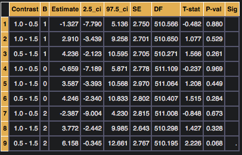
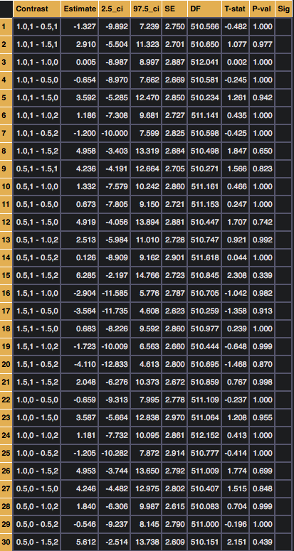
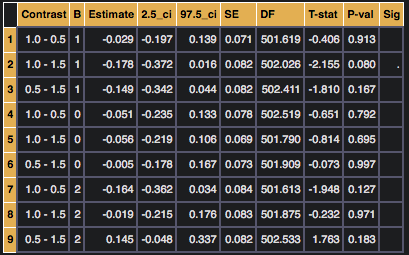

ANOVA tables and post-hoc comparisons
=====================================
ANOVA tables and orthogonal contrasts
-------------------------------------
Because ANOVA is just regression, :code:`pymer4` makes it easy to estimate ANOVA tables with F-results using the :code:`.anova()` method on a fitted model. By default this will compute a Type-III SS table given the coding scheme provided when the model was initially fit. Based on the distribution of data across factor levels and the specific factor-coding used, this may produce invalid Type-III SS computations. For this reason the :code:`.anova()` method has a :code:`force-orthogonal=True` option that will reparameterize and refit the model using orthogonal polynomial contrasts prior to computing an ANOVA table.

Marginal estimates and post-hoc comparisons
-------------------------------------------
:code:`pymer4` leverages the :code:`lsmeans` package in order to compute marginal estimates and pair-wise comparisons of models that contain categorical terms and/or interactions. This can be performed by using the :code:`.post_hoc()` method on fitted models with some examples below and in the method help. However, in order for this method to work appropriately, factors must be specified using the :code:`factors` argument of the :code:`model.fit()` method. Currently post-hoc comparisons are not possible from :code:`Lm()` models, only from :code:`Lmer()` models.

Examples
--------
Lets say that you're running a model which has two factors, A and B, with 3 levels each (i.e. 3x3 ANOVA). Below are some examples of how you could compute different types of post-hoc comparisons between factor levels.

**Example 1**
Compare each level of A to each other level of A, within each level of B:

.. code-block:: python

    # Specify post-hoc comparisons
    marginal_estimates, contrasts = model.post_hoc(marginal_vars='A',grouping_vars='B')

    # print them out
    contrasts

The mean of each "cell" of the ANOVA is available in the :code:`marginal_estimates` output:

.. image:: ../misc/marginal1.png

**Example 2**
Compare each unique A,B "cell" to every other A,B "cell":

.. code-block:: python

    # Specify post-hoc comparisons
    marginal_estimates, contrasts = model.post_hoc(marginal_vars=['A','B'])

    # print them out
    contrasts

Now lets say you run a model that has an interaction between a continuous variable C and two factors, A and B, with 3 levels each.

**Example 3**
Compare slopes of C at each level of A within each level of B:

.. code-block:: python

    # Specify post-hoc comparisons
    marginal_estimates, contrasts = model.post_hoc(marginal_vars='C',grouping_vars=['A','B'])

    # print them out
    contrasts

