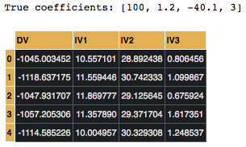
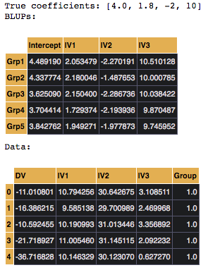

Simulating Data
===============

:code:`pymer4` comes with some easy-to-use functions for simulating data that can be modeled with :code:`Lm()` and multi-level data that can be modeled with :code:`Lmer()`. These functions can be found in the :code:`pymer4.simulate` module and are aptly named: :code:`simulate_lm()` and :code:`simulate_lmm()` respectively.

:code:`pymer4` gives you a lot of control over what you want your data to look like by setting properties such as:

- Number of data points and number of coefficients
- Specific coefficient values
- Means and standard deviations of predictors
- Correlations between predictors
- Amount of error (noise) in the data
- Number of groups/clusters (multi-level data only)
- Variance of random effects (multi-level data only)

Generating standard regression data
-----------------------------------
Generating data for a standard regression is simple and returns a pandas dataframe with outcome and predictor variables ready for use with :code:`Lm()`, along with a vector of coefficients used to produce the data.

Let's generate 500 observations, with predictors with the values: 1.2, -40.1, and 3. We also have an intercept with a value of 100. The means of the columns of our design matrix (i.e. means of the predictors) will be: 10, 30, and 1. We'll also add noise from a normal distribution with mean = 0, and sd = 5. Any correlations between predictors are purely random.

.. code-block:: python

    from pymer4.simulate import simulate_lm

    data, b = simulate_lm(500,
                          3,
                          coef_vals = [100,1.2,-40.1,3],
                          mus = [10,30,1],
                          noise_params = (0,5)
                         )
    print("True coefficients: {}".format(b))
    data.head()

Here are some checks you might do to make sure the data correctly generated:

.. code-block:: python

    # Check mean of predictors
    data.iloc[:,1:].mean(axis=0)

    # Check correlations between predictors
    data.iloc[:,1:].corr()

    # Check coefficient recovery
    from pymer4.models import Lm
    model = Lm('DV ~ IV1+IV2+IV3',data=data)
    model.fit()

However, you have the option of being as general or specific as possible when generating data. For example let's generate 100 observations with 5 predictors from a standard normal distribution, i.e. mean = 0, sd = 1 with no (random) correlations between predictors, and let :code:`pymer4` decide what to set the coefficient values to.

.. code-block:: python

    from pymer4.simulate import simulate_lm

    data,b = simulate_lm(100,5)

Generating multi-level regression data
--------------------------------------
Generating data for a multi-level regression is just as simple and returns a pandas dataframe with outcome and predictor variables ready for use with :code:`Lmer()`, another dataframe with group/cluster level estimates (i.e. BLUPs), and a vector of population-level coefficients.

Here's an example generating 5000 observations, organized as 100 groups with 50 observations each. We'll have three predictors with the values: 1.8, -2, and 10. We also have an intercept with a value of 4. The means of the columns of our design matrix (i.e. means of the predictors) will be: 10, 30, and 2. We'll also introduce correlations between our predictors of r = .15. We'll leave the default of standard normal noise i.e., mean = 0, and sd = 1.

.. code-block:: python

    from pymer4.simulate import simulate_lmm

    num_obs = 50
    num_coef = 3
    num_grps = 100
    mus = [10., 30., 2.]
    coef_vals = [4.,1.8,-2,10]
    corrs = .15

    data, blups, b = simulate_lmm(num_obs,
                          num_coef,
                          num_grps,
                          coef_vals = coef_vals,
                          mus = mus,
                          corrs = corrs)

    print("True coefficients: {}".format(b))
    print("BLUPs:")
    blups.head()
    print("Data:")
    data.head()

Again here are some checks you might do to make sure the data correctly generated (by default lmm data will generally be a bit noisier due to within and across group/cluster variance; see the API for how to customize this):

.. code-block:: python

    # Group the data before running checks
    group_data = data.groupby("Group")

    # Check mean of predictors
    group_data.apply(lambda grp: grp.iloc[:,1:-1].mean(axis=0)

    # Check correlations between predictors
    group_data.apply(lambda grp: grp.iloc[:,1:-1].corr

    # Check coefficient recovery
    from pymer4.models import Lmer
    model = Lmer('DV ~ IV1+IV2+IV3 + (IV1+IV2+IV3|Group)',data=data)
    model.fit()
