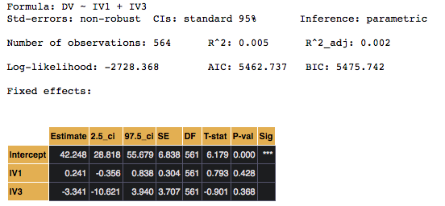
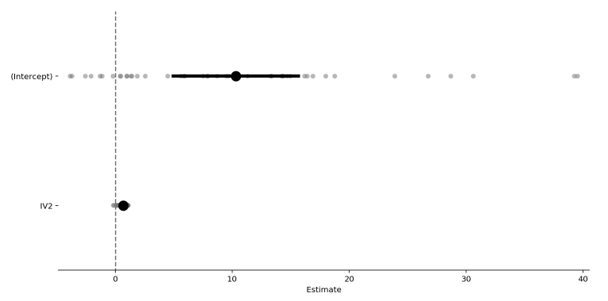
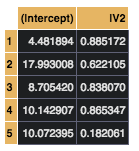
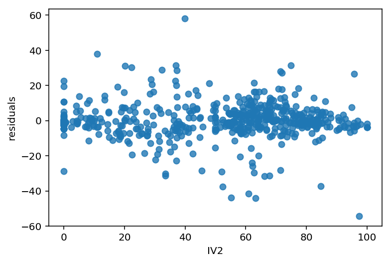

Basic Usage Guide
=================

The minimum required to fit a model is simply a long-format pandas data-frame with columns for: DV, IVs, and Grouping variables. :code:`pymer4` comes with sample data for testing purposes which we'll utilize here.

Let's take a quick look at the sample data:

.. code-block:: python

    import os
    import pandas as pd
    import seaborn as sns
    from pymer4.models import Lmer
    from pymer4.utils import get_resource_path

    df = pd.read_csv(os.path.join(get_resource_path(),'sample_data.csv'))
    df.head()

.. image:: ../misc/sample_data_head.png

For testing purposes we have two different kinds of dependent variables:

- Continuous (DV)
- Dichotomous (DV_l)

And two different kinds of independent variables:

- Continuous (IV1, IV2)
- Categorical (IV3)

We also have a grouping variable for multi-level modeling:

- Group

Estimate a standard regression model
------------------------------------
Fitting a standard regression model like using :code:`lm()` in R, simply entails initializing it with a model formula and pandas data-frame, and subsequently calling its :code:`fit` method.

.. code-block:: python

    # Initialize model instance
    model = Lm('DV ~ IV1 + IV3',data=df)

    # Fit it
    model.fit()

:code:`Lm()` models can also be fit with robust standard errors, bootstrapped confidence intervals, or permutation-tests using the :code:`robust`, :code:`conf_int`, and :code:`permute` flags during fitting. See the API docs for more information on their usage.

Estimate a multi-level model
----------------------------
Fitting a multi-level model works similarly.

.. code-block:: python

    # Initialize model instance
    model = Lmer('DV ~ IV2 + (IV2|Group)',data=df)

    # Fit it
    model.fit()

.. image:: ../misc/simple_summary_lmm.png

Visualize model summary
-----------------------
We can visualize the coefficients with 95% confidence intervals, and cluster level estimates overlaid.

.. code-block:: python

    model.plot_summary()

Inspect random effects
----------------------
We can look at the cluster level parameters easily as they are stored within the model object itself.

.. code-block:: python

    model.fixef.head()

Each row here is a unique intercept and slope, which vary because we parameterized our random effects that way above.

We can also plot these values with respect to the population parameters above in a slightly different way than the forest plot above. 

.. code-block:: python

    model.plot('IV2',
               plot_ci=True,
               ylabel= 'Predicted DV')

.. image:: ../misc/ranef_plot.png

If the model contains more than one predictor variable (unlike above) this plot will visualize a single predictor while other predictors are held constant.

Inspect other attributes
------------------------
Other model attributes are also conveniently accessible after fitting a model. For example, ``model.data`` contains a copy of the original dataframe used to fit the model, *plus* columns for model predictions and residuals and ``model.coefs`` contains fitted parameters. Generally you can see what other model properties are available by typing ``model.`` and pressing ``tab`` to see the list of attributes (and methods). This works for both ``Lm()`` and ``Lmer()`` models.

Inspect overall fit
-------------------
Using `seaborn <https://seaborn.pydata.org/>`_, it's trivial to assess model fit using residuals and predictions based on the values that :code:`pymer4` stores within its :code:`model.data` attribute. This attribute its a copy of the data itself with extra appended columns.

.. code-block:: python

    sns.regplot(x= 'IV2',
                y= 'residuals',
                data= model.data,
                fit_reg= False
                )

.. code-block:: python

    sns.regplot(x= 'fits',
                y= 'DV',
                units= 'Group',
                data= model.data,
                fit_reg= True
                )

.. image:: ../misc/fit_plot.png
